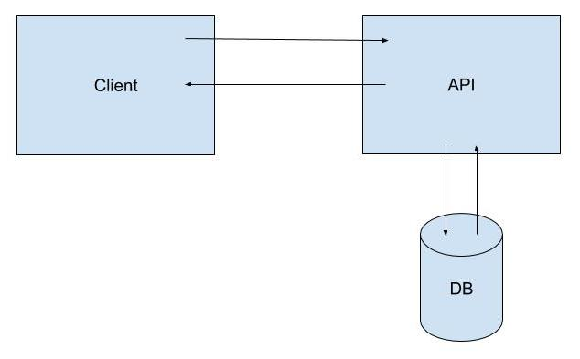

# Arquitetura

A aplicação consiste de uma API, usada para gerar versões encurtadas de urls. A API respeita os padrões REST, utilizando recursos e métodos de acordo com a operação.

### Visão geral

### Recursos

#### Plataforma
Foi usada a plataforma Java 8, em conjunto com Spring Boot 2.

#### Persistência
Utilizado o banco de dados não relacional MongoDB, pela facilidade de utilização e desempenho para o retorno da funcionalidade de redirecionamento.

#### Segurança
Camada de segurança utilizando Spring Security + OAuth2, gerando e validando os próprios tokens e clients.

#### Build
Construção da aplicação através de Maven e Docker, gerando o jar completo e executável, inserido na imagem utilizada para execução com balanceamento de carga.

### Fundamentação
Para a geração de urls encurtadas, é comum utilizar algum tipo de hash gerado através de um identificador único da operação. O Id textual do MongoDB acabou sendo uma escolha que facilitaria todo o processo de geração/redirecionamento. Apesar de não ser tão curto quanto o desejado, é possível uma melhoria futura utilizando algoritmos de encurtamento, como por exemplo esta [lib](https://github.com/treygriffith/short-mongo-id), adaptando e reescrevendo para o nosso caso de uso.

Com relação ao recolhimento de métricas, foi utilizada uma abordagem mais simples, incrementando a quantidade de cliques a cada visualização. Existe a possibilidade de melhoria, utilizando um evento assíncrono, como uma mensagem, sendo disparado a cada visualização, de forma a não onerar o banco de dados no momento do redirecionamento, significando uma resposta mais rápida.  

